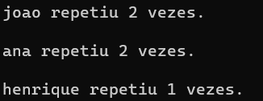

# Exercício 2 de Lista

### **Problema**
---
1. Crie uma lista linear que consiga armazenar um conjunto de 100 nomes quaisquer, os quais serão salvos de forma aleatória.
2. Crie uma função que consiga identificar replicações na lista, ou seja, nomes iguais e remova-as sem mover os "ponteiros".
3. Como você gerenciaria os espaços em branco para novas inserções? Qual seria o custo dessas novas inserções?
---

### **Solução**
---

1. Para a criação da lista foi utilizado métodos previamentes disponibilizados no repósitório [GitHub](https://github.com/mpiress/linear_list), do professor Michel Pires. No armazenamento do conjunto de nomes, foi necessário a leitura de um arquivo de formato <em>'.txt'</em> chamado <em>'nomes'</em>, neste arquivo deve-se escrever um nome por linha como mostra o exemplo a seguir:

Pedro 
Joao 
Alvaro 
Maria 

2. A função criada para identificar as replicações na lista possui o nome de <code>removeNomeRepetido</code>, esta função possui a seguinte estrutura. Dois <code><em>'for'</em></code>, o mais externo que servirá para "travar" a posição a ser comparada, este percorre toda a lista menos a última posição, pois não é preciso compará-la com nada, além disso possui um <code><em>'if'</em></code> e um contador sendo zerado que será explicado a seguir. 
O loop interno é onde a comparação e a remoção acontece, este percorre a partir da posição a frente do loop externo até o final da lista, dentro desse há um <code><em>'if'</em></code> que compara dois nomes através da função <code>strcmp</code>, que retorna 0 caso sejam iguais. Dentro deste bloco, um contador da repetição dos nomes é incrementado e é atribuído a posição atual da lista um status de <strong>true</strong>, dado pela variável booleana <code>repetido</code> adicionada na struct <code>Item</code> tornando o nome inacessível pelo <code><em>'if'</em></code> do <code><em>'for'</em></code> externo citado anteriormente. 
Por fim, há a impressão dos nomes repetidos seguido da quantidade de repetições dos mesmos.

3. Para novas inserções nesta lista nos espaços inacessíveis, precisaria apenas percorrer a lista procurando pelas posições que possuem <strong>true</strong> em sua variável <code>repetido</code> e sobrescrever o que desejasse nas mesmas. Com isso, o custo destas inserções seriam O(n), pois 'varre' o vetor uma vez.

Segue um exemplo de execução do código:

### **Entrada 'nomes.txt'**
---
- joao 
- pedro 
- ana 
- luisa 
- henrique 
- astolfo 
- vitor 
- joao 
- joao 
- ana 
- ana 
- henrique 
---

### **Saída**
---

---

# Compilação e Execução

O código apresentado possui um arquivo Makefile que realiza todo o procedimento de compilação e execução. Para tanto, temos as seguintes diretrizes de execução:

| Comando                |  Função                                                                                           |                     
| -----------------------| ------------------------------------------------------------------------------------------------- |
|  `make clean`          | Apaga a última compilação realizada contida na pasta build                                        |
|  `make`                | Executa a compilação do programa utilizando o gcc, e o resultado vai para a pasta build           |
|  `make run`            | Executa o programa da pasta build após a realização da compilação                                 |